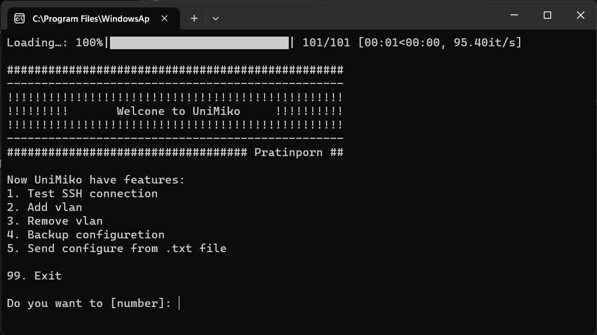
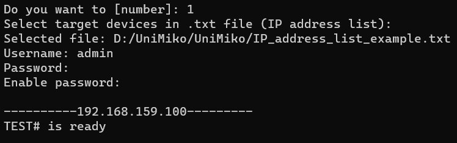

# UniMiko
 Network Engineer tools by using Netmiko 
  
 This project was developed to help engineer doing repeatly task in a few step.
  
  
 ## Examples
 *This is sample menu there have 5 functoins*  
 
  
 - You can put group or single IP address into program by .txt file via [Tkinter dialogs](https://docs.python.org/3/library/dialog.html).
 - Passwrod is hidden by using [getpass()](https://docs.python.org/3/library/getpass.html).
 
 

