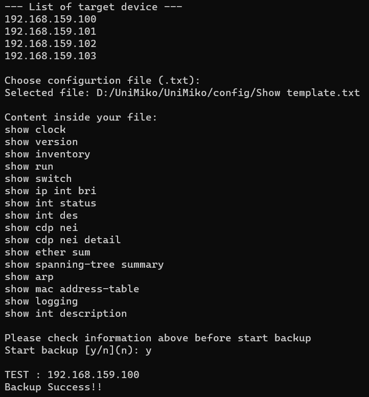
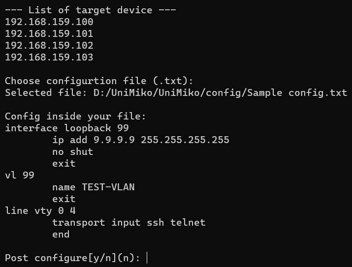

# UniMiko
Network Engineer tools by using Netmiko 
 
This project was developed to help engineer doing repeatly task in a few step.
 
I hope this program will be help and useful  
 
## Examples

 

- This is sample menu there have 5 functoins

 

- You can put group or single IP address into program by .txt file via [Tkinter dialogs](https://docs.python.org/3/library/dialog.html).
- Passwrod is hidden by using [getpass()](https://docs.python.org/3/library/getpass.html).
 

- In option 4 backup configuretion, you can choose your own show template via .txt file
- When backup success, program will write file into program folder location.

- In option 5 send config, you can choose your own config template via .txt file
- And post them by using [send_config_from_file()](https://ktbyers.github.io/netmiko/docs/netmiko/index.html#netmiko.BaseConnection.send_config_from_file)

## API Document
- [Netmiko](https://ktbyers.github.io/netmiko/docs/netmiko/index.html#netmiko.BaseConnection.send_config_from_file)
- [Tkinter](https://docs.python.org/3/library/tk.html)
- [getpass](https://docs.python.org/3/library/getpass.html)